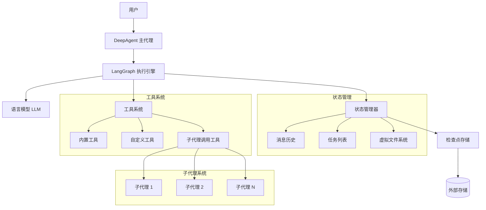
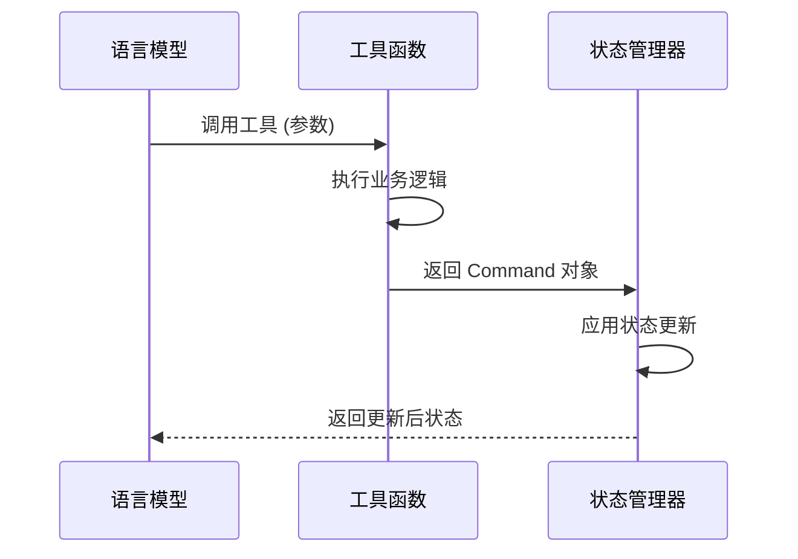
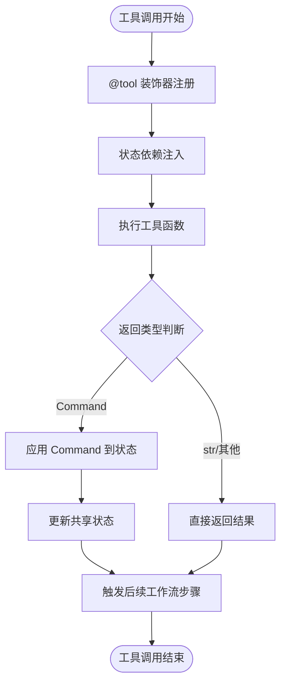
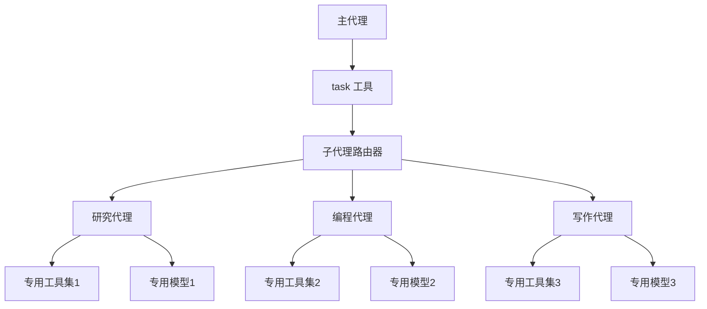
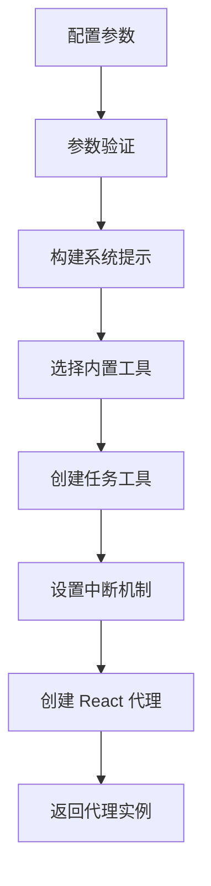
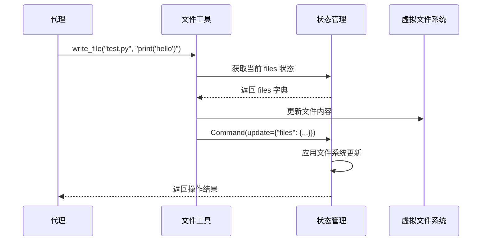
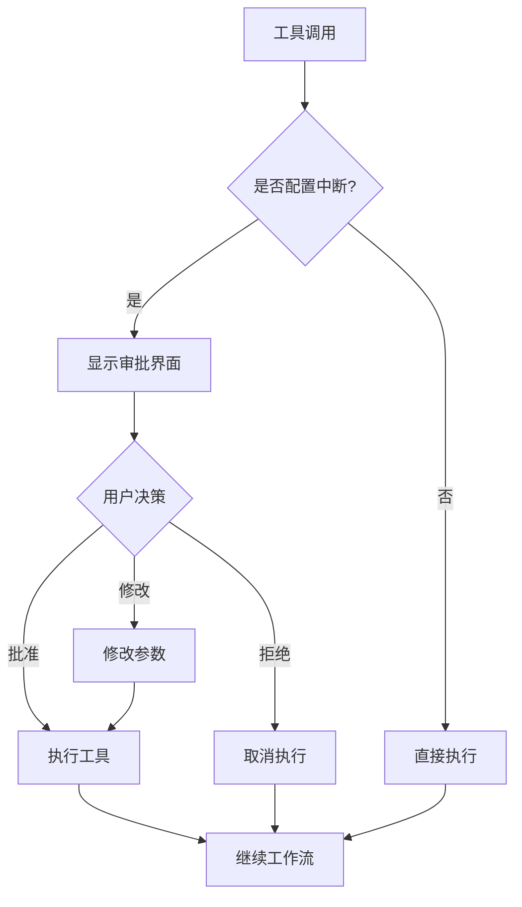

# DeepAgents 技术架构文档

## 1. 项目概述

### 1.1 项目简介
`deepagents` 是一个基于 Python 构建的智能代理框架，旨在通过实现规划工具、子代理、虚拟文件系统访问和详细提示，创建能够处理复杂任务的"深度代理"。该框架采用 LangGraph 作为核心执行引擎，通过状态管理和工具系统实现了强大的任务规划和执行能力。

### 1.2 核心价值
- **任务规划能力**: 通过内置的 `write_todos` 工具支持复杂任务的分解和管理
- **虚拟文件系统**: 提供沙箱环境，避免对真实文件系统的直接操作
- **子代理机制**: 支持上下文隔离和专门化处理不同类型任务
- **状态持久化**: 支持长时间运行任务和会话恢复
- **人机协作**: 支持人类在循环中审批工具执行

### 1.3 目标用户
- AI 工程师和研究人员
- 需要构建复杂智能代理的开发者
- 希望实现任务自动化的技术团队

## 2. 系统架构

### 2.1 整体架构概览



### 2.2 核心设计模式

#### 2.2.1 状态机模式
- **状态 (State)**: `DeepAgentState` 对象作为当前状态的完整快照
- **事件 (Event)**: 模型推理结果（工具调用）作为状态转换的驱动事件  
- **转换 (Transition)**: 工具函数执行实现状态转换
- **循环**: "模型推理 → 工具调用 → 状态更新"持续循环直到任务完成

#### 2.2.2 命令模式 (Command Pattern)
所有工具操作都通过 `Command` 对象封装状态更新操作：
- 将操作请求封装为对象
- 支持参数化、队列化和撤销操作
- 确保状态变更的可预测性和可追溯性

#### 2.2.3 依赖注入模式
通过 `InjectedState` 注解实现状态的依赖注入：
- 避免全局状态变量
- 提高代码可测试性
- 明确依赖关系，便于维护

## 3. 核心组件详解

### 3.1 状态管理系统

#### 3.1.1 DeepAgentState 结构
```python
class Todo(TypedDict):
    content: str
    status: Literal["pending", "in_progress", "completed"]

class DeepAgentState(AgentState):
    todos: NotRequired[list[Todo]]                    # 任务列表
    files: Annotated[NotRequired[dict[str, str]], file_reducer]  # 虚拟文件系统
    messages: list[BaseMessage]                       # 消息历史 (继承自AgentState)
```

#### 3.1.2 状态合并机制
- `file_reducer` 函数处理文件状态的并发更新
- 采用字典合并策略：`{**l, **r}` 
- 支持增量更新，避免状态冲突

#### 3.1.3 状态更新流程


### 3.2 工具系统架构

#### 3.2.1 内置工具集合

| 工具名称 | 功能描述 | 返回类型 |
|---------|---------|---------|
| `write_todos` | 更新任务列表，支持任务规划 | Command |
| `read_file` | 从虚拟文件系统读取文件，支持分页 | str |
| `write_file` | 向虚拟文件系统写入文件 | Command |
| `edit_file` | 精确字符串替换编辑文件 | Command |
| `ls` | 列出虚拟文件系统中的所有文件 | list[str] |
| `task` | 调用子代理执行专门任务 | str |

#### 3.2.2 工具注册和执行机制



#### 3.2.3 Command 模式实现
```python
from langgraph.types import Command

# Command 对象结构
return Command(
    update={
        "todos": updated_todos,
        "messages": [ToolMessage(f"操作完成", tool_call_id=tool_call_id)],
    }
)
```

### 3.3 子代理系统

#### 3.3.1 子代理架构


#### 3.3.2 子代理配置
```python
class SubAgent(TypedDict):
    name: str                           # 子代理名称
    description: str                    # 功能描述(供主代理决策使用)
    prompt: str                        # 系统提示词
    tools: NotRequired[list[BaseTool]] # 专用工具集 (可选)
    model: NotRequired[Union[str, LanguageModelLike, dict]] # 专用模型 (可选)
```

#### 3.3.3 上下文隔离机制
- 每个子代理拥有独立的提示词和工具集
- 通过 `task` 工具实现主代理与子代理的通信
- 子代理执行结果通过返回值传递给主代理
- 支持不同专业领域的任务处理

### 3.4 代理创建和配置

#### 3.4.1 create_deep_agent 函数
```python
def create_deep_agent(
    tools: Sequence[Union[BaseTool, Callable, dict[str, Any]]],  # 自定义工具
    instructions: str,                                           # 指令提示
    model: Optional[Union[str, LanguageModelLike]] = None,      # 语言模型
    subagents: list[SubAgent] = None,                           # 子代理列表
    state_schema: Optional[StateSchemaType] = None,             # 状态模式
    builtin_tools: Optional[list[str]] = None,                  # 内置工具选择
    interrupt_config: Optional[ToolInterruptConfig] = None,     # 中断配置
    config_schema: Optional[Type[Any]] = None,                  # 配置模式
    checkpointer: Optional[Checkpointer] = None,                # 检查点器
    post_model_hook: Optional[Callable] = None,                 # 后处理钩子
):
```

#### 3.4.2 配置流程


## 4. 虚拟文件系统

### 4.1 设计理念
- **沙箱环境**: 避免对真实文件系统的直接操作，提高安全性
- **状态隔离**: 文件系统状态存储在 `DeepAgentState.files` 字典中
- **可重现性**: 支持完整的状态序列化和恢复

### 4.2 文件操作流程


### 4.3 支持的操作
- **写入**: `write_file(file_path, content)` - 创建或覆盖文件
- **读取**: `read_file(file_path, offset=0, limit=None)` - 读取文件内容，支持分页
- **编辑**: `edit_file(file_path, old_string, new_string, replace_all=False)` - 精确替换
- **列表**: `ls()` - 列出所有文件名

## 5. 人机协作机制

### 5.1 工具中断配置
```python
class ToolInterruptConfig(TypedDict):
    tool_name: str                    # 需要中断的工具名称
    requires_approval: bool           # 是否需要人工审批
    approval_message: str             # 审批提示消息
```

### 5.2 中断处理流程


## 6. 扩展机制

### 6.1 自定义工具开发

#### 6.1.1 基本规范
```python
from langchain_core.tools import tool
from langgraph.prebuilt import InjectedState
from typing import Annotated

@tool(description="工具功能描述")
def custom_tool(
    param1: str,
    param2: int,
    state: Annotated[DeepAgentState, InjectedState]
) -> Union[str, Command]:
    """自定义工具实现"""
    # 1. 从状态获取数据
    current_data = state.get("custom_field", {})
    
    # 2. 执行业务逻辑
    result = process_data(param1, param2, current_data)
    
    # 3. 返回结果或状态更新
    if need_state_update:
        return Command(update={"custom_field": result})
    else:
        return str(result)
```

#### 6.1.2 集成自定义工具
```python
custom_tools = [custom_tool, another_tool]

agent = create_deep_agent(
    tools=custom_tools,
    instructions="代理指令",
    model="gpt-4"
)
```

### 6.2 状态模式扩展

#### 6.2.1 扩展状态字段
```python
class CustomAgentState(DeepAgentState):
    custom_data: NotRequired[dict[str, Any]]
    workflow_status: NotRequired[str]
    
agent = create_deep_agent(
    tools=tools,
    instructions=instructions,
    state_schema=CustomAgentState
)
```

### 6.3 模型配置

#### 6.3.1 支持的模型类型
- **字符串**: 模型名称 (如 "gpt-4", "claude-3")
- **LanguageModelLike**: LangChain 兼容的模型实例
- **字典**: 模型配置参数

#### 6.3.2 多模型支持
```python
# 主代理使用 GPT-4
main_model = "gpt-4"

# 子代理使用不同模型
research_subagent = SubAgent(
    name="researcher", 
    description="执行研究任务",
    prompt="你是一个专业的研究助手...",
    model="claude-3-opus"  # 使用不同模型
)
```

## 7. 性能优化

### 7.1 状态管理优化
- **增量更新**: 仅更新变化的状态字段
- **状态压缩**: 支持状态序列化和压缩存储  
- **延迟加载**: 按需加载大型状态数据

### 7.2 工具执行优化
- **并发执行**: 支持多个独立工具的并发调用
- **缓存机制**: 缓存常用工具的执行结果
- **批处理**: 支持批量文件操作

### 7.3 内存管理
- **消息历史截断**: 自动管理过长的消息历史
- **状态清理**: 定期清理不再需要的状态数据
- **检查点策略**: 智能检查点创建和清理

## 8. 安全考虑

### 8.1 虚拟文件系统安全
- **路径限制**: 仅支持扁平文件结构，避免路径遍历攻击
- **内容限制**: 可配置文件大小和数量限制
- **类型检查**: 严格的文件类型和内容验证

### 8.2 工具执行安全
- **沙箱隔离**: 所有工具在隔离环境中执行
- **权限控制**: 精细化的工具权限管理
- **审计日志**: 完整的工具调用和状态变更日志

### 8.3 API 密钥管理
- **环境变量**: 推荐使用环境变量存储 API 密钥
- **密钥轮换**: 支持 API 密钥的定期更换
- **访问控制**: 基于角色的 API 访问权限

## 9. 部署和运维

### 9.1 安装部署
```bash
# 基础安装
pip install deepagents

# 开发安装
git clone https://github.com/langchain-ai/deepagents
cd deepagents
pip install -e .
```

### 9.2 环境配置
```python
# 基本配置
import os
os.environ["OPENAI_API_KEY"] = "your-api-key"
os.environ["TAVILY_API_KEY"] = "your-tavily-key"  # 用于网络搜索

# 创建代理
from deepagents import create_deep_agent

agent = create_deep_agent(
    tools=[],
    instructions="你是一个有用的AI助手"
)
```

### 9.3 监控和维护
- **状态监控**: 监控代理状态和性能指标
- **错误处理**: 完善的异常处理和恢复机制
- **日志管理**: 结构化的日志记录和分析

## 10. 最佳实践

### 10.1 任务规划
- **频繁使用 `write_todos`**: 对于复杂任务，及时分解和跟踪
- **状态及时更新**: 完成任务后立即标记为完成状态
- **合理任务粒度**: 避免任务过于复杂或过于简单

### 10.2 子代理使用
- **专门化设计**: 为不同领域设计专门的子代理
- **清晰描述**: 提供准确的子代理功能描述
- **工具隔离**: 为子代理配置合适的专用工具集

### 10.3 状态管理
- **定期检查点**: 为长时间运行的任务设置检查点
- **状态清理**: 及时清理不再需要的临时状态
- **版本控制**: 对重要状态变更进行版本管理

## 11. 未来发展方向

### 11.1 技术增强
- **多层文件系统**: 支持目录结构和文件权限
- **分布式执行**: 支持多节点分布式代理执行
- **流式处理**: 实时流式状态更新和结果输出

### 11.2 功能扩展
- **可视化界面**: 提供代理状态和执行过程的可视化
- **协作机制**: 支持多个代理之间的协作和通信
- **学习能力**: 基于历史执行经验的自我优化

### 11.3 生态完善
- **工具市场**: 提供丰富的第三方工具插件
- **模板库**: 常见应用场景的代理模板
- **社区支持**: 活跃的开发者社区和技术支持

---

## 结语

DeepAgents 框架通过创新的状态管理、工具系统和子代理机制，为构建复杂智能代理提供了强大而灵活的基础设施。其基于 LangGraph 的架构设计既保证了系统的稳定性和可扩展性，又为开发者提供了丰富的定制和扩展能力。

随着 AI 技术的不断发展，DeepAgents 将继续演进，为构建更加智能、可靠和实用的 AI 代理系统贡献力量。